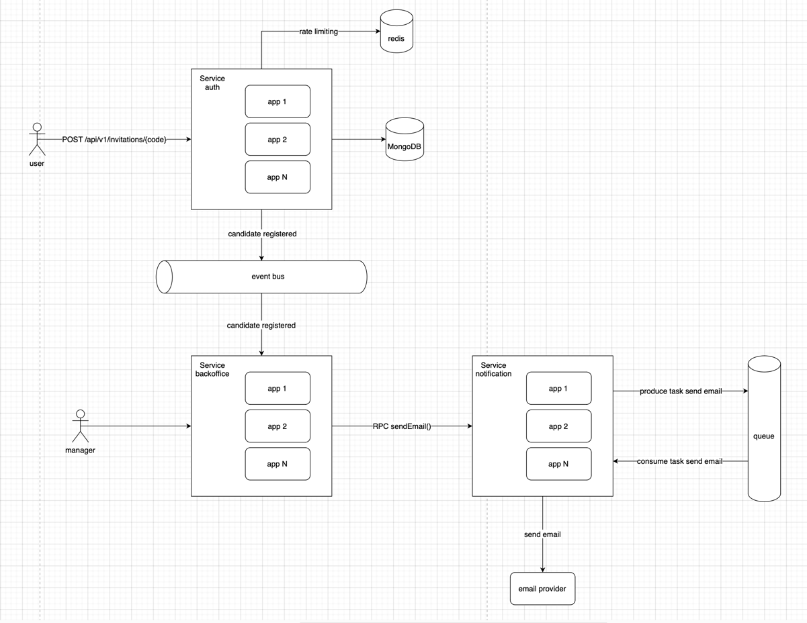

# Goragames assignment
Description - https://goragames.notion.site/Go-Code-Challenge-7e7bd13c0a554271905d6babe9481b62

## Requirements
* Docker-compose

## Basic usage
```shell
make up # build image and run server with all dependencies and migrations
make stop # stop all containers
make down #stop and remove all containers
```

## Mongo-express
Available on http://localhost:8081
### Credentials:
login: user \
password: password

## Request example
```shell
curl -X POST --data '{"email": "my_email@gmailcom"}' localhost:8080/api/v1/invitations/twitter-reg1
```

## Things to improve
1. On startup save all codes into RAM to avoid database calls for nonexistent codes
2. Find migration library for proper version control (right now it's just a bunch of db insert requests)
3. Add translation for errors
4. Add email validation
4. Trigger CustomerRegisteredV1 event on success
5. Add rate limit on registration tries

## Project architecture

